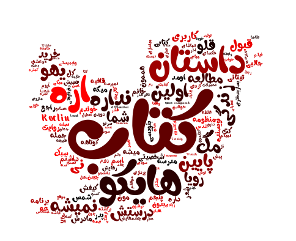
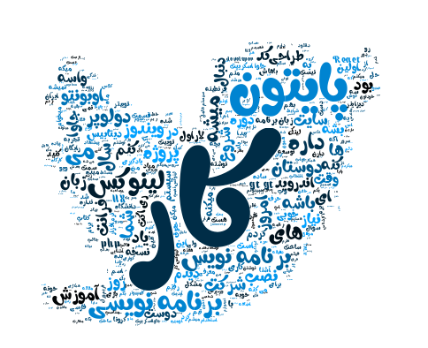

# Twitter Word Cloud

Explore on your tweets and create a picture by your most common words!

## Creat Your Cloud

First of all create a `.env` file exactly like `.env.example` file.

You might have a developer twitter account to run this project (if you don't have, don't worry!
I will add another way to connect to twitter without a dev account, soon ;) )

You should just add your **APP_KEY** and **APP_SECRET** to `.env` and run the project!

Answer the question like below:

    Do you have a developer twitter account? [y/n] y
    Enter username: MyUsername
    Use default font? [y/n] n 
    Enter font path: ./fonts/Roya.ttf   # You can add your own font under fonts directory
    Use default maximum word(500 words)? [y/n] n
    Enter number of maximum word: 200
    Use default image? [y/n] n
    Enter image path: ./twitter.jpg     # You can add your own image
    Choose color: 1.Blue 2.Red 3.Green 4.Yellow: 1

Your image with be saved on the root of the project with name `my_own_cloud.png`

### I Am Tired :(

Are you tired to answer all of these question every time?!

I have another choice for you! Fill the other field in your `.env` file like the above question and then change `i_am_tired` variable on the top of the `functions.py` to `True`!

That's it ;)

